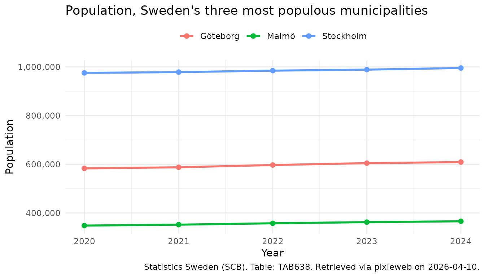

# Quick start guide to pixieweb

This vignette provides a quick start guide to get up and running with
`pixieweb` as fast as possible. For a more comprehensive introduction to
the `pixieweb` package, see [Introduction to
pixieweb](https://lchansson.github.io/pixieweb/articles/introduction-to-pixieweb.md).

``` r
library("pixieweb")
```

In this guide we walk you through five steps to connect to a PX-Web API,
find a table, inspect its variables, download data and plot it. We’ll
use Statistics Sweden (SCB) as our example throughout.

PX-Web tables are *multi-dimensional data cubes*. Each table has one or
more **variables** (dimensions) — for example, region, sex and year —
and one or more **content codes** (what is being measured). To download
data you specify which values you want along each variable. See
[`vignette("introduction-to-pixieweb")`](https://lchansson.github.io/pixieweb/articles/introduction-to-pixieweb.md)
for a deeper explanation of the data model.

### 1. Connect to an API

`pixieweb` ships with a catalogue of known PX-Web instances.
[`px_api()`](https://lchansson.github.io/pixieweb/reference/px_api.md)
accepts either a known alias (such as `"scb"`, `"ssb"`, `"statfi"`) or a
full base URL.

``` r
scb <- px_api("scb", lang = "en")
scb
```

    #> PX-Web API: Statistics Sweden (SCB) (v2, en)
    #>   Max cells: 150000 | Rate limit: 30/10s

To see all known APIs, run
[`px_api_catalogue()`](https://lchansson.github.io/pixieweb/reference/px_api_catalogue.md).

### 2. Find a table

PX-Web organises data into **tables**. Use
[`get_tables()`](https://lchansson.github.io/pixieweb/reference/get_tables.md)
to search the catalogue (server-side on v2 APIs, folder walk on v1):

``` r
tables <- get_tables(scb, query = "population")

dplyr::glimpse(tables)
```

    #> Rows: 26
    #> Columns: 13
    #> $ id           <chr> "TAB638", "TAB1743", "TAB934", "TAB4552", "TAB6473", "TAB…
    #> $ title        <chr> "Population by region, marital status, age and sex.  Year…
    #> $ description  <chr> "", "", "", "", "", "", "", "", "", "", "", "", "", "", "…
    #> $ category     <chr> "public", "public", "public", "public", "public", "public…
    #> $ updated      <chr> "2025-02-21T07:00:00Z", "2015-10-01T07:30:00Z", "2015-10-…
    #> $ first_period <chr> "1968", "1995", "1995", "1960", "2025M01", "2000M01", "20…
    #> $ last_period  <chr> "2024", "2013", "2013", "2023", "2026M01", "2024M12", "20…
    #> $ time_unit    <chr> "Annual", "Annual", "Annual", "Annual", "Monthly", "Month…
    #> $ variables    <list> ["region", "marital status", "age", "sex", "observations…
    #> $ subject_code <chr> "BE", "LE", "LE", "MI", "BE", "BE", "BE", "BE", "MI", "LE…
    #> $ subject_path <chr> "Population > Population statistics > Number of inhabitan…
    #> $ source       <chr> "Statistics Sweden", "Statistics Sweden", "Statistics Swe…
    #> $ discontinued <lgl> FALSE, FALSE, FALSE, FALSE, FALSE, FALSE, FALSE, FALSE, F…

The result is a tibble. You can narrow it further on the client side
with
[`table_search()`](https://lchansson.github.io/pixieweb/reference/table_search.md),
and inspect candidate tables with
[`table_describe()`](https://lchansson.github.io/pixieweb/reference/table_describe.md):

``` r
tables |>
  table_search("municipal") |>
  table_describe(max_n = 2, format = "md", heading_level = 4)
#> Warning: No tables to describe.
```

[`table_describe()`](https://lchansson.github.io/pixieweb/reference/table_describe.md)
shows the subject path, time period range, and data source alongside the
title — making it much easier to pick the right table.

### 3. Explore variables

Once you have a table ID, inspect what variables (dimensions) it has.
[`get_variables()`](https://lchansson.github.io/pixieweb/reference/get_variables.md)
returns a tibble with one row per variable:

``` r
vars <- get_variables(scb, "TAB638")
vars |> variable_describe()
```

    #> ── Region (region) ────────────────────────────────────────────────────────────── 
    #>   Values: 312, optional (elimination) 
    #>   First values: 00 Sweden, 01 Stockholm county, 0114 Upplands Väsby, 0115 Vallentuna, 0117 Österåker ... and 307 more 
    #>   Codelists: agg_RegionA-region_2 A-regions, agg_RegionLA1998 Local labour markets 1998, agg_RegionLA2003_1 Local labour markets 2003 ... and 15 more 
    #> 
    #> ── Civilstand (marital status) ────────────────────────────────────────────────── 
    #>   Values: 4, optional (elimination) 
    #>   First values: OG single, G married, ÄNKL widowers/widows, SK divorced 
    #> 
    #> ── Alder (age) ────────────────────────────────────────────────────────────────── 
    #>   Values: 102, optional (elimination) 
    #>   First values: 0 0 years, 1 1 year, 2 2 years, 3 3 years, 4 4 years ... and 97 more 
    #>   Codelists: agg_Ålder10årJ ´10-year intervals, agg_Ålder5år 5-year intervals, vs_Ålder1årA Age, 1 year age classes ... and 1 more 
    #> 
    #> ── Kon (sex) ──────────────────────────────────────────────────────────────────── 
    #>   Values: 2, optional (elimination) 
    #>   First values: 1 men, 2 women 
    #> 
    #> ── ContentsCode (observations) ────────────────────────────────────────────────── 
    #>   Values: 2, mandatory 
    #>   First values: BE0101N1 Population, BE0101N2 Population growth 
    #> 
    #> ── Tid (year) ─────────────────────────────────────────────────────────────────── 
    #>   Values: 57, mandatory 
    #>   Time variable: Yes
    #>   First values: 1968 1968, 1969 1969, 1970 1970, 1971 1971, 1972 1972 ... and 52 more

You can inspect the available values for any single variable with
[`variable_values()`](https://lchansson.github.io/pixieweb/reference/variable_values.md):

``` r
vars |> variable_values("Region")
```

    #> # A tibble: 312 × 2
    #>    code  text            
    #>    <chr> <chr>           
    #>  1 00    Sweden          
    #>  2 01    Stockholm county
    #>  3 0114  Upplands Väsby  
    #>  4 0115  Vallentuna      
    #>  5 0117  Österåker       
    #>  6 0120  Värmdö          
    #>  7 0123  Järfälla        
    #>  8 0125  Ekerö           
    #>  9 0126  Huddinge        
    #> 10 0127  Botkyrka        
    #> # ℹ 302 more rows

### 4. Get data

Now we know which variables the table has and what values are available.
Pass your selections to
[`get_data()`](https://lchansson.github.io/pixieweb/reference/get_data.md):

- **`ContentsCode`** tells the API *what* to measure (population,
  deaths, etc.). `"*"` means “all measures in this table”.
- Variables you **omit** are *eliminated* — the API returns a
  pre-computed aggregate (for example, omitting a `Sex` variable gives
  totals for both sexes). Not every variable is eliminable; see
  [`vignette("introduction-to-pixieweb")`](https://lchansson.github.io/pixieweb/articles/introduction-to-pixieweb.md)
  for the distinction between mandatory and eliminable variables.
- Selection helpers like
  [`px_top()`](https://lchansson.github.io/pixieweb/reference/px_selections.md),
  [`px_from()`](https://lchansson.github.io/pixieweb/reference/px_selections.md)
  and
  [`px_range()`](https://lchansson.github.io/pixieweb/reference/px_selections.md)
  let you select values without knowing exact codes. Use them when you
  want “the latest N periods” or “everything from 2020 onward”.

``` r
pop <- get_data(scb, "TAB638",
  Region = c("0180", "1480", "1280"),
  ContentsCode = "*",
  Tid = px_top(5)
)

dplyr::glimpse(pop)
```

    #> Rows: 30
    #> Columns: 8
    #> $ table_id          <chr> "TAB638", "TAB638", "TAB638", "TAB638", "TAB638", "T…
    #> $ Region            <chr> "0180", "0180", "0180", "0180", "0180", "0180", "018…
    #> $ Region_text       <chr> "Stockholm", "Stockholm", "Stockholm", "Stockholm", …
    #> $ ContentsCode      <chr> "BE0101N1", "BE0101N1", "BE0101N1", "BE0101N1", "BE0…
    #> $ ContentsCode_text <chr> "Population", "Population", "Population", "Populatio…
    #> $ Tid               <chr> "2020", "2021", "2022", "2023", "2024", "2020", "202…
    #> $ Tid_text          <chr> "2020", "2021", "2022", "2023", "2024", "2020", "202…
    #> $ value             <dbl> 975551, 978770, 984748, 988943, 995574, 1477, 3219, …

Notice the `_text` suffix:
[`get_data()`](https://lchansson.github.io/pixieweb/reference/get_data.md)
returns both raw code columns (`Region = "0180"`) and human-readable
label columns (`Region_text = "Stockholm"`). Use `_text` columns for
display and plotting; use the raw codes for filtering and joining.

### 5. Inspect and visualise results

Finally, time to plot our data:

``` r
library("ggplot2")

pop_plot <- pop |>
  # Keep only the Population content code (the table also has
  # "Population growth"); convert year to Date for nice axis breaks
  dplyr::filter(ContentsCode == "BE0101N1") |>
  dplyr::mutate(year = as.Date(paste0(Tid, "-01-01")))

ggplot(pop_plot, aes(year, value, colour = Region_text)) +
  # One line per region
  geom_line(linewidth = 1) +
  geom_point(size = 2) +
  # Years as dates — ensures whole-year breaks, not decimals
  scale_x_date(date_breaks = "1 year", date_labels = "%Y") +
  scale_y_continuous(labels = scales::comma) +
  labs(
    title = "Population, Sweden's three most populous municipalities",
    x = "Year",
    y = "Population",
    colour = NULL,
    caption = px_cite(pop)
  ) +
  theme_minimal() +
  theme(legend.position = "top")
```



Note the use of
[`px_cite()`](https://lchansson.github.io/pixieweb/reference/px_cite.md)
to produce a citation for the downloaded data, and the conversion of
`Tid` to `Date` before plotting: years as `Date` keep
[`scale_x_date()`](https://ggplot2.tidyverse.org/reference/scale_date.html)
on whole years (e.g. 2020, 2021, 2022) rather than producing decimal
breaks like 2020, 2022.5, 2025. This is a pattern you will want to reuse
for any time-series analysis across `pixieweb`, `rKolada` and `rTrafa`.

Other useful helpers you may want to explore next:

- [`data_minimize()`](https://lchansson.github.io/pixieweb/reference/data_minimize.md)
  — remove columns where all values are identical
- [`data_legend()`](https://lchansson.github.io/pixieweb/reference/data_legend.md)
  — generate a caption string from variable metadata
- [`prepare_query()`](https://lchansson.github.io/pixieweb/reference/prepare_query.md)
  — build queries with sensible defaults for tables with many variables

## Next steps

- **Deeper walkthrough** —
  [`vignette("introduction-to-pixieweb")`](https://lchansson.github.io/pixieweb/articles/introduction-to-pixieweb.md)
  covers the full data model, codelists, wide output, saved queries and
  advanced query composition.
- **Multiple countries** —
  [`vignette("multi-api")`](https://lchansson.github.io/pixieweb/articles/multi-api.md)
  shows how to compare data across national statistics agencies (SCB,
  SSB, Statistics Finland and more).
- **ggplot2 reference** — <https://ggplot2-book.org/> for more on
  visualisation.

## Related packages

`pixieweb` is part of a family of R packages for Swedish and Nordic open
statistics that share the same design philosophy:

- [rKolada](https://lchansson.github.io/rKolada/) — R client for the
  [Kolada](https://kolada.se/) database of Swedish municipal and
  regional Key Performance Indicators
- [rTrafa](https://lchansson.github.io/rTrafa/) — R client for the
  [Trafa](https://api.trafa.se/) API of Swedish transport statistics
