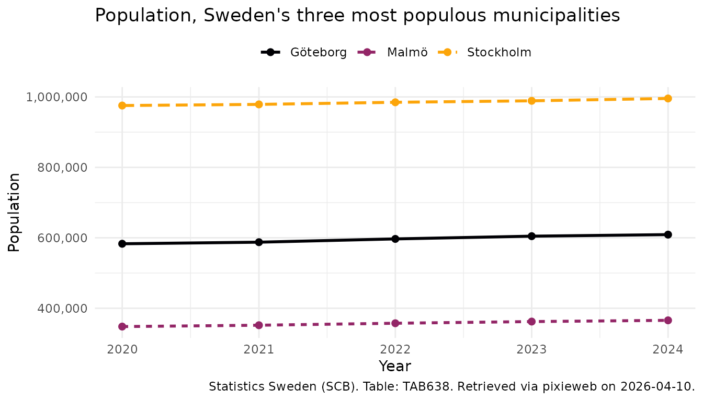

# Introduction to pixieweb

`pixieweb` is an R package for *discovering*, *inspecting* and
*downloading* statistical data from [PX-Web](https://www.scb.se/px-web)
APIs — the platform used by Statistics Sweden (SCB), Statistics Norway
(SSB), Statistics Finland, and many other national statistics agencies.
This vignette provides an overview of the methods included in the
`pixieweb` package and the design principles of the package API. To
learn more about the specifics of functions and to see a full list of
the functions included, please see the [Reference section of the package
homepage](https://lchansson.github.io/pixieweb/reference/index.html) or
run `??pixieweb`. For a quick introduction to the package see the
vignette [Quick start guide to
pixieweb](https://lchansson.github.io/pixieweb/articles/a-quickstart.md).

> **Note on pxweb:** The excellent
> [pxweb](https://cran.r-project.org/package=pxweb) package by rOpenGov
> already provides comprehensive R access to PX-Web APIs. `pixieweb` is
> not a replacement — it offers an *alternative paradigm* built around
> search-then-fetch discovery and progressive disclosure. Choose the
> workflow that fits your needs.

The design of `pixieweb` functions is inspired by the design and
functionality provided by several packages in the `tidyverse` family.
pixieweb uses the base R pipe (`|>`) throughout. Some vignette examples
use `dplyr`, `tidyr`, and `ggplot2` for data wrangling and
visualisation:

``` r
install.packages("pixieweb")
```

## PX-Web, a platform for national statistical databases

[PX-Web](https://www.scb.se/px-web) is the statistical database platform
used by national statistics agencies across the Nordic countries and
beyond. Each agency runs its own instance — Statistics Sweden at
[scb.se](https://www.scb.se), Statistics Norway at
[ssb.no](https://www.ssb.no), Statistics Finland at
[stat.fi](https://www.stat.fi), and many more — but they all share the
same underlying API, which comes in two versions:

- **v1** — the legacy API, still widely deployed. POST-only data
  queries, no search endpoint, table discovery requires walking a folder
  hierarchy.
- **v2** — the modern API, launched by SCB in 2024. GET+POST data
  queries, full-text search, codelists endpoint, server-side saved
  queries.

`pixieweb` handles both versions transparently — the user-facing
functions have the same signatures, and only the internal request
building differs.

To get started with PX-Web you might want to visit the web frontend of
any participating agency, or read through the [PxWebApi2
documentation](https://github.com/PxTools/PxApiSpecs) (English).
However, you can also use the `pixieweb` package to explore data without
prior knowledge of the database.

``` r
library("pixieweb")
```

### The data model

Data in PX-Web are stored as *multi-dimensional data cubes*. Each agency
publishes hundreds or thousands of **tables**, and each table defines
its own set of **variables** (dimensions) along which observations are
indexed. A typical population table might, for instance, be indexed by
region, sex, age and year — while a foreign trade table might be indexed
by partner country, commodity group and month.

When downloading data, the user needs to specify which values to include
along each variable — or omit the variable entirely, in which case the
API returns a pre-computed aggregate (this is called *elimination*).
Every table has its own rules for which variables are *mandatory* and
which are *eliminable*.

In summary, a PX-Web table is organised along four basic concepts:

- An **API instance** — a particular agency’s PX-Web database (e.g. SCB,
  SSB)
- A **table** — a single statistical data cube published by that agency
- A set of **variables** — the dimensions of the cube (region, time,
  sex, product, etc.); each variable has a set of valid **values**
- One or more **content codes** — what is actually being measured in
  each cell (population count, deaths, tax revenue, GDP, …)

Tables with multiple content codes can return data in either *long*
format (one row per observation, one column for the content code) or
*wide* format (one column per content code) — see the section on wide
output below.

Additionally, many variables come with one or more **codelists** —
alternative groupings of the values that can be used to aggregate data
on the fly. For example, a “Region” variable with 290 municipalities
might offer codelists that group them into 21 counties, or into eight
NUTS-2 regions.

`pixieweb` provides a function family for each of these concepts:

| Level        | Discover                                                                                   | Search                                                                                   | Describe                                                                                     | Extract                                                                                            | Values                                                                                   |
|--------------|--------------------------------------------------------------------------------------------|------------------------------------------------------------------------------------------|----------------------------------------------------------------------------------------------|----------------------------------------------------------------------------------------------------|------------------------------------------------------------------------------------------|
| API instance | [`px_api_catalogue()`](https://lchansson.github.io/pixieweb/reference/px_api_catalogue.md) | —                                                                                        | —                                                                                            | —                                                                                                  | —                                                                                        |
| Table        | [`get_tables()`](https://lchansson.github.io/pixieweb/reference/get_tables.md)             | [`table_search()`](https://lchansson.github.io/pixieweb/reference/table_search.md)       | [`table_describe()`](https://lchansson.github.io/pixieweb/reference/table_describe.md)       | [`table_extract_ids()`](https://lchansson.github.io/pixieweb/reference/table_extract_ids.md)       | —                                                                                        |
| Variable     | [`get_variables()`](https://lchansson.github.io/pixieweb/reference/get_variables.md)       | [`variable_search()`](https://lchansson.github.io/pixieweb/reference/variable_search.md) | [`variable_describe()`](https://lchansson.github.io/pixieweb/reference/variable_describe.md) | [`variable_extract_ids()`](https://lchansson.github.io/pixieweb/reference/variable_extract_ids.md) | [`variable_values()`](https://lchansson.github.io/pixieweb/reference/variable_values.md) |
| Codelist     | [`get_codelists()`](https://lchansson.github.io/pixieweb/reference/get_codelists.md)       | —                                                                                        | [`codelist_describe()`](https://lchansson.github.io/pixieweb/reference/codelist_describe.md) | [`codelist_extract_ids()`](https://lchansson.github.io/pixieweb/reference/codelist_extract_ids.md) | [`codelist_values()`](https://lchansson.github.io/pixieweb/reference/codelist_values.md) |
| Data         | [`get_data()`](https://lchansson.github.io/pixieweb/reference/get_data.md)                 | —                                                                                        | —                                                                                            | —                                                                                                  | —                                                                                        |

### Connecting to an API

All `pixieweb` workflows start by connecting to a PX-Web instance.
[`px_api()`](https://lchansson.github.io/pixieweb/reference/px_api.md)
accepts a short alias (`"scb"`, `"ssb"`, `"statfi"`, …) or a full URL:

``` r
# Known aliases
scb <- px_api("scb", lang = "en")
ssb <- px_api("ssb", lang = "en")

# Or a custom URL
custom <- px_api("https://my.statbank.example/api/v2/", lang = "en")

# See all known APIs
px_api_catalogue()
```

    #> # A tibble: 13 × 7
    #>    alias    description                 url   url_v1 versions langs default_lang
    #>    <chr>    <chr>                       <chr> <chr>  <list>   <lis> <chr>       
    #>  1 scb      Statistics Sweden (SCB)     http… https… <chr>    <chr> sv          
    #>  2 ssb      Statistics Norway (SSB)     http… https… <chr>    <chr> no          
    #>  3 statfi   Statistics Finland          http… https… <chr>    <chr> fi          
    #>  4 statis   Statistics Iceland          http… https… <chr>    <chr> en          
    #>  5 hagstova Statistics Faroe Islands    http… https… <chr>    <chr> fo          
    #>  6 statgl   Statistics Greenland        http… https… <chr>    <chr> da          
    #>  7 asub     Statistics Åland (ÅSUB)     http… https… <chr>    <chr> sv          
    #>  8 sjv      Swedish Board of Agricultu… http… https… <chr>    <chr> sv          
    #>  9 energi   Swedish Energy Agency (Ene… http… https… <chr>    <chr> sv          
    #> 10 fohm     Public Health Agency of Sw… http… https… <chr>    <chr> sv          
    #> 11 konj     National Institute of Econ… http… https… <chr>    <chr> sv          
    #> 12 msb      Swedish Civil Contingencie… http… https… <chr>    <chr> sv          
    #> 13 slu      Swedish University of Agri… http… https… <chr>    <chr> sv

For cross-country comparison and a fuller tour of the multi-API
catalogue, see
[`vignette("multi-api")`](https://lchansson.github.io/pixieweb/articles/multi-api.md).

### Discovering tables: `get_tables()`

Tables are the central entity. On v2 APIs,
[`get_tables()`](https://lchansson.github.io/pixieweb/reference/get_tables.md)
sends a server-side search query; on v1 APIs, it walks the folder tree.
In both cases the result is a tibble with rich metadata, one row per
table:

``` r
# Search the SCB catalogue for population-related tables
tables <- get_tables(scb, query = "population")

head(tables)
```

    #> # A tibble: 6 × 13
    #>   id      title  description category updated first_period last_period time_unit
    #>   <chr>   <chr>  <chr>       <chr>    <chr>   <chr>        <chr>       <chr>    
    #> 1 TAB638  Popul… ""          public   2025-0… 1968         2024        Annual   
    #> 2 TAB1743 Incom… ""          public   2015-1… 1995         2013        Annual   
    #> 3 TAB934  Famil… ""          public   2015-1… 1995         2013        Annual   
    #> 4 TAB4552 Popul… ""          public   2025-0… 1960         2023        Annual   
    #> 5 TAB6473 Popul… ""          public   2026-0… 2025M01      2026M01     Monthly  
    #> 6 TAB1625 Popul… ""          public   2025-0… 2000M01      2024M12     Monthly  
    #> # ℹ 5 more variables: variables <list>, subject_code <chr>, subject_path <chr>,
    #> #   source <chr>, discontinued <lgl>

The table tibble includes subject path, time period range, time unit,
and data source — all of which are searchable by
[`table_search()`](https://lchansson.github.io/pixieweb/reference/table_search.md)
(a client-side filter, analogous to `kpi_search()` in `rKolada`).

``` r
# Narrow down to tables about municipalities
tables |>
  table_search("municipal") |>
  table_describe(max_n = 2, format = "md", heading_level = 4)
#> Warning: No tables to describe.
```

[`table_describe()`](https://lchansson.github.io/pixieweb/reference/table_describe.md)
prints a human-readable summary of each table. As with all `describe`
functions in the `pixieweb`/`rKolada`/`rTrafa` family, you can set
`format = "md"` to produce Markdown output that can be embedded directly
in an R Markdown document by setting the chunk option
`results = 'asis'`.

### Exploring variables: `get_variables()`

Once you have chosen a table, inspect its variables with
[`get_variables()`](https://lchansson.github.io/pixieweb/reference/get_variables.md):

``` r
vars <- get_variables(scb, "TAB638")
vars |> variable_describe()
```

    #> ── Region (region) ────────────────────────────────────────────────────────────── 
    #>   Values: 312, optional (elimination) 
    #>   First values: 00 Sweden, 01 Stockholm county, 0114 Upplands Väsby, 0115 Vallentuna, 0117 Österåker ... and 307 more 
    #>   Codelists: agg_RegionA-region_2 A-regions, agg_RegionLA1998 Local labour markets 1998, agg_RegionLA2003_1 Local labour markets 2003 ... and 15 more 
    #> 
    #> ── Civilstand (marital status) ────────────────────────────────────────────────── 
    #>   Values: 4, optional (elimination) 
    #>   First values: OG single, G married, ÄNKL widowers/widows, SK divorced 
    #> 
    #> ── Alder (age) ────────────────────────────────────────────────────────────────── 
    #>   Values: 102, optional (elimination) 
    #>   First values: 0 0 years, 1 1 year, 2 2 years, 3 3 years, 4 4 years ... and 97 more 
    #>   Codelists: agg_Ålder10årJ ´10-year intervals, agg_Ålder5år 5-year intervals, vs_Ålder1årA Age, 1 year age classes ... and 1 more 
    #> 
    #> ── Kon (sex) ──────────────────────────────────────────────────────────────────── 
    #>   Values: 2, optional (elimination) 
    #>   First values: 1 men, 2 women 
    #> 
    #> ── ContentsCode (observations) ────────────────────────────────────────────────── 
    #>   Values: 2, mandatory 
    #>   First values: BE0101N1 Population, BE0101N2 Population growth 
    #> 
    #> ── Tid (year) ─────────────────────────────────────────────────────────────────── 
    #>   Values: 57, mandatory 
    #>   Time variable: Yes
    #>   First values: 1968 1968, 1969 1969, 1970 1970, 1971 1971, 1972 1972 ... and 52 more

Each variable has a number of important properties worth knowing about:

- **`elimination`** — can this variable be left out of your
  [`get_data()`](https://lchansson.github.io/pixieweb/reference/get_data.md)
  call? If `TRUE`, omitting the variable means the API returns a
  pre-computed total (e.g. omitting “Sex” gives the total for all
  sexes). If `FALSE`, the variable is **mandatory** and must be included
  in the query.
- **`time`** — is this the time dimension of the cube? (There is always
  exactly one.)
- **`values`** — the set of available codes and their human-readable
  labels.
- **`codelists`** — alternative groupings of the values (see the
  “Codelists” section below).

To inspect the available values for a specific variable, use
[`variable_values()`](https://lchansson.github.io/pixieweb/reference/variable_values.md):

``` r
vars |> variable_values("Region")
```

    #> # A tibble: 312 × 2
    #>    code  text            
    #>    <chr> <chr>           
    #>  1 00    Sweden          
    #>  2 01    Stockholm county
    #>  3 0114  Upplands Väsby  
    #>  4 0115  Vallentuna      
    #>  5 0117  Österåker       
    #>  6 0120  Värmdö          
    #>  7 0123  Järfälla        
    #>  8 0125  Ekerö           
    #>  9 0126  Huddinge        
    #> 10 0127  Botkyrka        
    #> # ℹ 302 more rows

### Downloading data: `get_data()`

[`get_data()`](https://lchansson.github.io/pixieweb/reference/get_data.md)
is the workhorse function. Provide an API object, a table ID, and one
argument per variable you want to include in the query:

``` r
pop <- get_data(scb, "TAB638",
  Region = c("0180", "1480", "1280"),
  ContentsCode = "*",
  Tid = px_top(5)
)

head(pop)
```

    #> # A tibble: 6 × 8
    #>   table_id Region Region_text ContentsCode ContentsCode_text Tid   Tid_text
    #>   <chr>    <chr>  <chr>       <chr>        <chr>             <chr> <chr>   
    #> 1 TAB638   0180   Stockholm   BE0101N1     Population        2020  2020    
    #> 2 TAB638   0180   Stockholm   BE0101N1     Population        2021  2021    
    #> 3 TAB638   0180   Stockholm   BE0101N1     Population        2022  2022    
    #> 4 TAB638   0180   Stockholm   BE0101N1     Population        2023  2023    
    #> 5 TAB638   0180   Stockholm   BE0101N1     Population        2024  2024    
    #> 6 TAB638   0180   Stockholm   BE0101N2     Population growth 2020  2020    
    #> # ℹ 1 more variable: value <dbl>

Variables you **omit** are *eliminated* (aggregated) if the API allows
it. If a variable is mandatory, you must include it —
[`get_data()`](https://lchansson.github.io/pixieweb/reference/get_data.md)
will raise an informative error otherwise.

#### Selection helpers

Often you don’t want to hardcode specific codes. `pixieweb` provides a
family of selection helpers that translate common wishes into
API-compatible arguments:

| Helper            | Meaning                           | API versions |
|-------------------|-----------------------------------|--------------|
| `c("0180")`       | Specific values                   | v1, v2       |
| `"*"`             | All values                        | v1, v2       |
| `px_top(5)`       | First N values (e.g. most recent) | v1, v2       |
| `px_bottom(3)`    | Last N values                     | v2 only      |
| `px_from("2020")` | From value onward                 | v2 only      |
| `px_to("2023")`   | Up to value                       | v2 only      |
| `px_range(a, b)`  | Inclusive range                   | v2 only      |

### Metadata-driven queries: `prepare_query()`

An alternative approach to downloading data using known codes is to use
the metadata tables to construct queries. For interactive exploration,
[`prepare_query()`](https://lchansson.github.io/pixieweb/reference/prepare_query.md)
inspects the table’s variable metadata and builds a query with sensible
defaults, so that you only need to specify the variables you care about:

``` r
q <- prepare_query(scb, "TAB638",
  Region = c("0180", "1480", "1280")
)
q
```

    #> ── Query: TAB638 ──────────────────────────────────────────────────────────────── 
    #>   Estimated cells: 60 / 150000 (0% of limit)
    #> 
    #>   Region = c("0180", "1480", "1280")
    #>     user override
    #>   Civilstand = <eliminated>
    #>     eliminated (4 values available)
    #>   Alder = <eliminated>
    #>     eliminated (102 values available)
    #>   Kon = <eliminated>
    #>     eliminated (2 values available)
    #>   ContentsCode = "*"
    #>     all 2 content variable(s)
    #>   Tid = px_top(10)
    #>     latest 10 of 57 periods

The default strategy is:

- **Content code**: all values (`"*"`)
- **Time variable**: latest 10 periods (`px_top(10)`)
- **Eliminable variables**: omitted (API aggregates)
- **Small mandatory variables** (≤ 22 values): all (`"*"`)
- **Large mandatory variables**: first value (`px_top(1)`)

With `maximize_selection = TRUE`, the function expands unspecified
variables to include as many values as possible while staying under the
API’s cell limit. Once you’re happy, pass the validated query to
[`get_data()`](https://lchansson.github.io/pixieweb/reference/get_data.md):

``` r
pop <- get_data(scb, query = q)
```

## Codelists

Codelists provide alternative groupings of variable values. They are
useful when you want data at a different aggregation level than the
table’s default. For example, a “Region” variable with 290 Swedish
municipalities might have a codelist that groups them into 21 counties
(`vs_RegionLän07`):

``` r
cls <- get_codelists(scb, "TAB638", "Region")
cls |> codelist_describe(max_n = 3)
```

    #> ── agg_RegionA-region_2: A-regions ────────────────────────────────────────────── 
    #>   Type: Aggregation 
    #>   Values: 70 items 
    #>   First: A-01 Stockholms/Södertälje A-region, A-02 Norrtälje A-region, A-03 Enköpings A-region, A-04 Uppsala A-region, A-05 Nyköpings A-region ... and 65 more 
    #> 
    #> ── agg_RegionLA1998: Local labour markets 1998 ────────────────────────────────── 
    #>   Type: Aggregation 
    #>   Values: 100 items 
    #>   First: 01001LA Stockholm LA, 04001LA Nyköping-Oxelösund LA, 04002LA Katrineholm LA, 04003LA Eskilstuna LA, 05001LA Linköping LA ... and 95 more 
    #> 
    #> ── agg_RegionLA2003_1: Local labour markets 2003 ──────────────────────────────── 
    #>   Type: Aggregation 
    #>   Values: 87 items 
    #>   First: LA0301 Stockholm LA, LA0302 Nyköping-Oxelösund LA, LA0303 Eskilstuna LA, LA0304 Linköping LA, LA0305 Norrköping LA ... and 82 more

Apply a codelist in a query via the `.codelist` argument:

``` r
# Fetch data aggregated to counties instead of municipalities
get_data(scb, "TAB638",
  Region = "*",
  Tid = px_top(5),
  ContentsCode = "*",
  .codelist = list(Region = "vs_RegionLän07")
)
```

## Wide output and multiple content codes

When a table has multiple content codes (e.g. both Population and
Deaths), the default long format has one row per content code per
observation. Use `.output = "wide"` to pivot the content codes into
separate columns — useful when you want to compute with several measures
(e.g. death rate = Deaths / Population):

``` r
demo <- get_data(scb, "TAB638",
  Region = "0180",
  Tid = px_top(5),
  ContentsCode = "*",
  .output = "wide"
)
demo
```

    #> # A tibble: 5 × 7
    #>   table_id Region Region_text Tid   Tid_text BE0101N1 BE0101N2
    #>   <chr>    <chr>  <chr>       <chr> <chr>       <dbl>    <dbl>
    #> 1 TAB638   0180   Stockholm   2020  2020       975551     1477
    #> 2 TAB638   0180   Stockholm   2021  2021       978770     3219
    #> 3 TAB638   0180   Stockholm   2022  2022       984748     5978
    #> 4 TAB638   0180   Stockholm   2023  2023       988943     4195
    #> 5 TAB638   0180   Stockholm   2024  2024       995574     6631

## Visualising results

To explore results we can plot the downloaded data using `ggplot2`. Note
that we convert the time column to a `Date` first — years as integer can
produce awkward ggplot breaks like “2020, 2022.5, 2025”, and a proper
`Date` column lets
[`scale_x_date()`](https://ggplot2.tidyverse.org/reference/scale_date.html)
place tick marks on whole years. This is a pattern you will want to use
for any time-series analysis across all three sibling packages
(`rKolada`, `pixieweb`, `rTrafa`):

``` r
library("ggplot2")

pop_plot <- pop |>
  # Keep only the Population content code (the table also has
  # "Population growth"); convert year to Date for nice axis breaks
  dplyr::filter(ContentsCode == "BE0101N1") |>
  dplyr::mutate(year = as.Date(paste0(Tid, "-01-01")))

ggplot(pop_plot, aes(year, value, colour = Region_text)) +
  # One line per region; linetype adds distinction in B/W print
  geom_line(aes(linetype = Region_text), linewidth = 1) +
  geom_point(size = 2) +
  # Years as dates, one tick per year
  scale_x_date(date_breaks = "1 year", date_labels = "%Y") +
  scale_y_continuous(labels = scales::comma) +
  # Colour-blind-friendly palette
  scale_colour_viridis_d(option = "B", end = 0.8) +
  labs(
    title = "Population, Sweden's three most populous municipalities",
    x = "Year",
    y = "Population",
    colour = NULL,
    linetype = NULL,
    caption = px_cite(pop)
  ) +
  theme_minimal() +
  theme(legend.position = "top")
```



> **More on ggplot2?** See <https://ggplot2-book.org/>.

## Advanced: query composition

For full control over the HTTP request — useful for debugging or when
you need to inspect/modify the exact query before sending it — use the
low-level query composers:

``` r
q <- compose_data_query(scb, "TAB638",
  Region = c("0180"),
  ContentsCode = "*",
  Tid = px_top(3)
)

# Inspect the query
q$url
q$body

# Modify and execute
raw <- execute_query(scb, q$url, q$body)
```

## Saved queries (v2 only)

PX-Web v2 supports server-side stored queries — useful for recurring
reports. Save a query once, then retrieve it by ID later:

``` r
# Save a query
id <- save_query(scb, "TAB638",
  Region = "0180",
  Tid = px_top(5),
  ContentsCode = "*"
)

# Retrieve later
get_saved_query(scb, id)
```

## Citation

Always cite your data sources.
[`px_cite()`](https://lchansson.github.io/pixieweb/reference/px_cite.md)
generates a citation string from the metadata attached to a downloaded
data frame:

``` r
px_cite(pop)
```

    #> [1] "Statistics Sweden (SCB). Table: TAB638. Retrieved via pixieweb on 2026-04-10."

## Related packages

`pixieweb` is part of a family of R packages for Swedish and Nordic open
statistics that share the same design philosophy:

- [rKolada](https://lchansson.github.io/rKolada/) — R client for the
  [Kolada](https://kolada.se/) database of Swedish municipal and
  regional Key Performance Indicators
- [rTrafa](https://lchansson.github.io/rTrafa/) — R client for the
  [Trafa](https://api.trafa.se/) API of Swedish transport statistics

See also [pxweb](https://cran.r-project.org/package=pxweb) — the
original and established PX-Web client for R, by rOpenGov.
